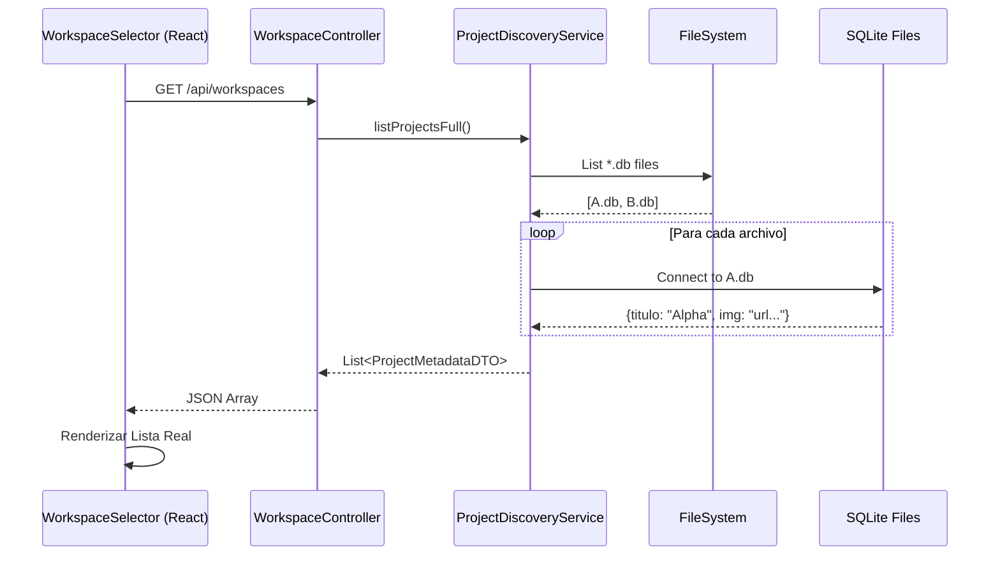

# Arquitectura de Gestión de Proyectos (Workspaces)

**Estado: IMPLEMENTADO (Feb 2026)**

Este documento describe la arquitectura técnica para la gestión de múltiples proyectos ("Universos") en la aplicación.

## Visión General

La aplicación funciona bajo un modelo **Multi-Tenant de Archivo Único**. Cada proyecto es un archivo SQLite independiente (`Proyecto.db`) en la carpeta `src/main/resources/data/`.

### Flujo de Datos (Implementado V2)

1. **Frontend (`WorkspaceSelector.jsx`)**:
    * Renderiza la lista de proyectos usando datos reales (`title`, `imageUrl`, `initials`).
    * Permite acciones CRUD ("Edit", "Delete") que llaman a los servicios backend reales.
    * No utiliza "Mock Data".

2. **Backend (`WorkspaceController.java`)**:
    * Endpoint `listWorkspaces()` devuelve `List<ProjectMetadataDTO>`.

3. **Servicio (`ProjectDiscoveryService.java`)**:
    * Método `listProjectsFull()` implementado.
    * Escanea archivos `.db` atómicamente.
    * Abre una conexión JDBC efímera a cada base de datos para extraer `titulo`, `genero` e `imagen_url` reales.

## Referencia de Arquitectura (Histórico)

La refactorización para eliminar datos simulados se completó en Febrero 2026. El sistema ahora es totalmente dinámico.

