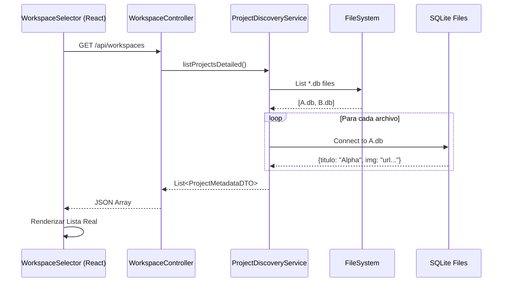

# Arquitectura de Gestión de Proyectos (Workspaces)

Este documento describe la arquitectura técnica para la gestión de múltiples proyectos ("Universos") en la aplicación, su estado actual y el plan de refactorización para eliminar datos simulados (mocks).

## Visión General

La aplicación funciona bajo un modelo **Multi-Tenant de Archivo Único**. Cada proyecto es un archivo SQLite independiente (`Proyecto.db`) en la carpeta `src/main/resources/data/`.

### Flujo de Datos Actual (Con Mock Data)

1. **Frontend (`WorkspaceSelector.jsx`)**:
    * Llama a `GET /api/workspaces`.
    * Recibe una lista de strings: `["Default World", "Proyecto X"]`.
    * **PROBLEMA**: Genera metadatos falsos (Imagen, Título visual, Género, Tiempo) usando `getMockData(name)` basado en el hash del nombre. Los cambios reales en DB no se ven.

2. **Backend (`WorkspaceController.java`)**:
    * Endpoint `listWorkspaces()` llama al servicio.
    * Devuelve `List<String>`.

3. **Servicio (`ProjectDiscoveryService.java`)**:
    * Escanea la carpeta de datos.
    * Devuelve nombres de archivos `.db`.
    * **LIMITACIÓN**: No abre los archivos para leer sus metadatos reales.

## Arquitectura Objetivo (Refactorizada)

El objetivo es que el frontend sea "tonto" y solo renderice lo que el backend le dice.

### 1. Modelo de Datos (DTO)

Nueva clase `ProjectMetadataDTO`:

```java
public class ProjectMetadataDTO {
    String filename;   // ID técnico (nombre archivo)
    String title;      // Título real (ej: "Las Crónicas de Narnia")
    String genre;
    String imageUrl;
    String lastModified; // "Hace 2h" (Calculado o real)
    String initials;     // "LC"
}
```

### 2. Servicio Mejorado (`ProjectDiscoveryService`)

* **Método `listProjectsDetailed()`**:
  * Itera sobre cada archivo `.db`.
  * **Conexión JDBC Efímera**: Abre una conexión rápida a cada BD.
  * Ejecuta `SELECT titulo, genero, imagen_url, fecha_modificacion FROM cuaderno LIMIT 1`.
  * Mapea los resultados al DTO.
  * Menciona: Si falla la lectura, devuelve un DTO con datos por defecto ("Archivo Corrupto").

### 3. Limpieza (Código a Eliminar)

* [Frontend] Función `getMockData()` en `WorkspaceSelector.jsx`.
* [Frontend] Arrays hardcoded de imágenes aleatorias.
* [Frontend] Lógica de generación de colores/tags basada en hash.

## Diagrama de Flujo



## Plan de Ejecución

1. **Backend**: Crear `ProjectMetadataDTO`.
2. **Backend**: Actualizar `ProjectDiscoveryService` para leer SQLite masivamente.
3. **Backend**: Actualizar `WorkspaceController` para devolver la lista compleja.
4. **Frontend**: Eliminar `getMockData` y adaptar `WorkspaceSelector` para usar props reales.
