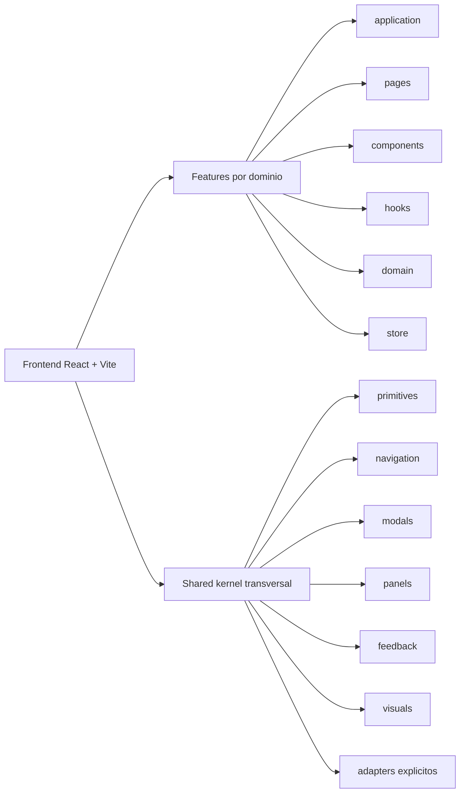
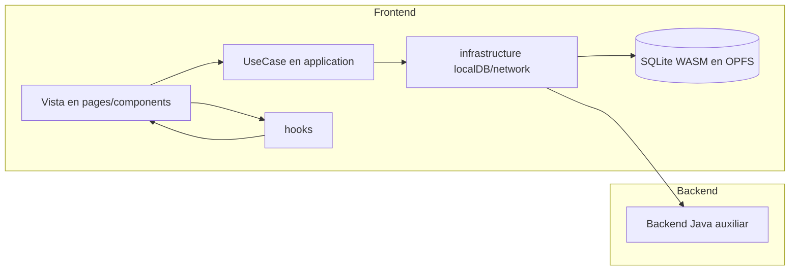

# Chronos Atlas - Worldbuilding Engine

Chronos Atlas es una aplicación de worldbuilding local-first para escritura, planificación narrativa, mapas, relaciones, líneas temporales y gestión de entidades dinámicas.

La base funcional actual se centra en:

- Frontend React + TypeScript + Vite con arquitectura feature-first (vertical slices).
- Persistencia local en SQLite WASM (SQLocal) sobre OPFS.
- Backend Java auxiliar para bridge de sistema de archivos, backups y endpoints de soporte.

## Estado Actual

El proyecto está en evolución activa. La documentación técnica vive en la carpeta Docs y este README refleja estructura y stack vigentes del repositorio.

## Stack Tecnológico Actual

### Frontend

- React 19.2.4
- TypeScript 5.7.x (strict)
- Vite 6
- Zustand
- TanStack Query
- TanStack Table
- React Router
- MapLibre + Deck.gl
- Tiptap
- Tailwind CSS

### Persistencia

- SQLocal (SQLite WASM)
- OPFS (Origin Private File System)

### Backend Auxiliar

- Java 21
- Spring Web MVC 5.3.31
- Jetty embebido
- Maven

## Dibujo Explicativo de Arquitectura

### 1) Vista Estructural (Carpetas y Ownership)



### 2) Vista Runtime (Flujo de Ejecución)



## Estructura Principal de Carpetas

```text
WorlBuilding-Writting-App/
├── frontend/
│   ├── public/
│   ├── src/
│   │   ├── infrastructure/
│   │   │   ├── localDB/
│   │   │   ├── network/
│   │   │   └── utils/
│   │   ├── features/
│   │   │   ├── Shared/
│   │   │   │   ├── primitives/
│   │   │   │   ├── navigation/
│   │   │   │   ├── modals/
│   │   │   │   ├── panels/
│   │   │   │   ├── feedback/
│   │   │   │   ├── visuals/
│   │   │   │   ├── editor/
│   │   │   │   ├── adapters/
│   │   │   │   ├── index.ts
│   │   │   │   └── StatCard.tsx
│   │   │   ├── Entities/
│   │   │   │   ├── application/
│   │   │   │   ├── components/
│   │   │   │   ├── hooks/
│   │   │   │   ├── pages/
│   │   │   │   └── index.ts
│   │   │   └── ... otras features
│   │   ├── locales/
│   │   └── types/
│   ├── package.json
│   └── vite.config.ts
├── backend/
│   ├── src/main/java/com/worldbuilding/
│   │   ├── core/
│   │   └── domains/
│   ├── pom.xml
│   └── mvnw.cmd
├── Docs/
├── scripts/
├── LICENSE.txt
└── LICENSE-MPL-2.0.txt
```

## Ejecución Local

### Opción rápida (Windows)

Desde scripts:

```bat
run-app.bat
```

### Opción manual

Frontend:

```bash
cd frontend
npm install
npm run dev
```

Backend auxiliar:

```bat
cd backend
mvnw.cmd compile exec:java -Dexec.mainClass=com.worldbuilding.core.AuxServerApplication
```

## Build

Frontend:

```bash
cd frontend
npm run build
```

Chequeo de guardrails arquitectónicos:

```bash
cd frontend
npm run arch:check
```

Backend:

```bat
cd backend
mvnw.cmd -DskipTests package
```

## Documentación de Proyecto

- Reglas maestras: Docs/00_Reglas_Maestras.md
- Estrategia técnica: Docs/01_Estrategia_Tecnica.md
- Diseño UI/UX: Docs/02_Diseño_UI_UX.md
- Roadmap vivo: Docs/03_Roadmap_Vivo.md
- Arquitectura de workspaces: Docs/04_Arquitectura_Workspaces.md

## Convenciones de Arquitectura Frontend

- Arquitectura objetivo: Feature-Sliced Architecture (vertical slices).
- Carpeta estándar por feature según necesidad: application, components, hooks, pages, domain, store.
- Regla de hooks:
  - Hook reutilizable dentro de la feature: hooks/
  - Hook exclusivo de una pantalla: colocalizado en pages/
- index.ts de cada feature permanece en raíz como API pública.
- Evitar imports profundos entre features; consumir `@features/<Feature>` como API pública.
- Shared funciona como kernel transversal; adapters de negocio legacy viven en `Shared/adapters`.

## Licenciamiento

El proyecto mantiene un modelo de licencia dual. Consultar:

- LICENSE.txt
- LICENSE-MPL-2.0.txt
